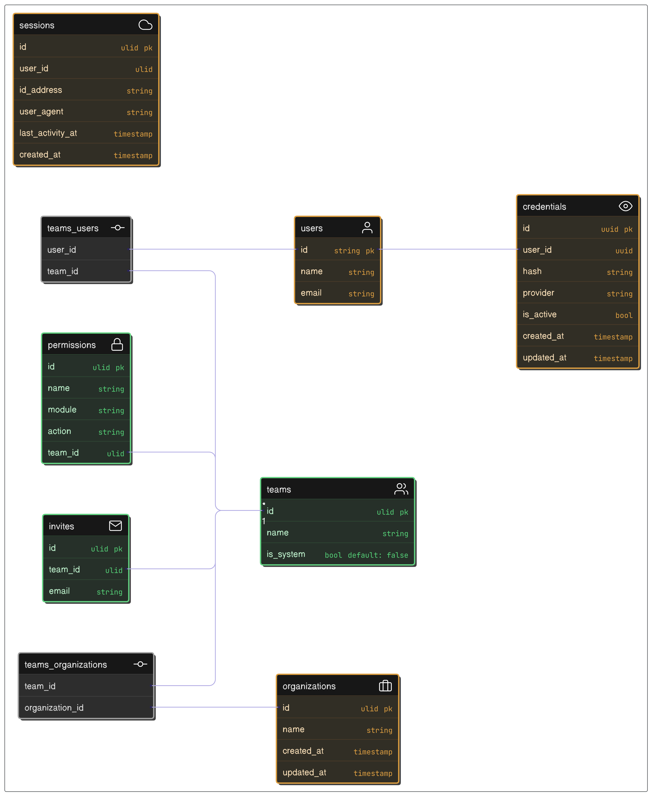

# Authentication and authorization application

Project developed with the objective of deepening knowledge in Java using the Spring Boot framework, applying the principles of clean architecture and exploring communication between microservices.

Image below shows the database modeling



## Technologies/library

- [Spring Boot](https://spring.io/projects/spring-boot)
- [Spring Security](https://spring.io/projects/spring-security)
- [Spring Data JPA](https://spring.io/projects/spring-data-jpa)
- [PostgreSQL](https://www.postgresql.org/)
- [Flyway](https://flywaydb.org/)
- [Flyway Spring Boot](https://github.com/flyway/flyway-spring-boot)

## Tasks

This repository is still a work-in-progress. Here's the current progress:

- [ ] Configuration
  - [x] Data structure definition
  - [x] Migration structure definition
  - [x] Domain structure definition
  - [x] Infrastructure structure definition
  - [ ] Test structure definition
- [ ] Resources
    - [ ] Users
      - [x] Register
      - [ ] Validate account
      - [ ] Reset password
      - [ ] Access blocking
    - [ ] Authentication
      - [ ] Token validation
      - [ ] Token renewal
      - [ ] Authentication session
        - [ ] Session limiter active per user
        - [ ] Invalidate active session
        - [ ] List with all active sessions
    - [ ] Authorization/Permissions
      - [ ] Access group registration
        - [ ] Register of permitted actions
    - [ ] Organization
      - [ ] Register
      - [ ] Access blocking 
    - [ ] Send emails
      - [ ] User activation
      - [ ] Confirmation of new registration
      - [ ] Password reset
    - [ ] Configuration
      - [ ] Email Settings
      - [ ] Files Storage
      - [ ] Backups
      - [ ] Logs
      - [ ] Metrics
      - [ ] Export/Import data
- [ ] Event listeners
  - [ ] Register organization
  - [ ] ??? 
- [ ] Deployment

--- 

## Setup

1. Download the repository `git clone git@github.com:mr4torr/saas-auth.git`;
2. Make a copy of the `.env.example` file and place it as `.env`;
3. Create a docker-compose.yml file, this file is used to run the database.
4. Run `docker compose up -d` and then run `./mvnw spring-boot:run`
5. Go to `http://localhost:8080` to access the API. -Access `http://localhost:8080/swagger-ui.html` to view the API documentation.-
6. Go to `./doc/http` to see all mapped endpoints
 
```yml
version: '3.8'
services:
  postgres:
    image: postgres:17.4-alpine
    container_name: saas_db
    environment:
      POSTGRES_DB: saas
      POSTGRES_USER: postgres
      POSTGRES_PASSWORD: root
    ports:
      - "5432:5432"
    restart: always
```
