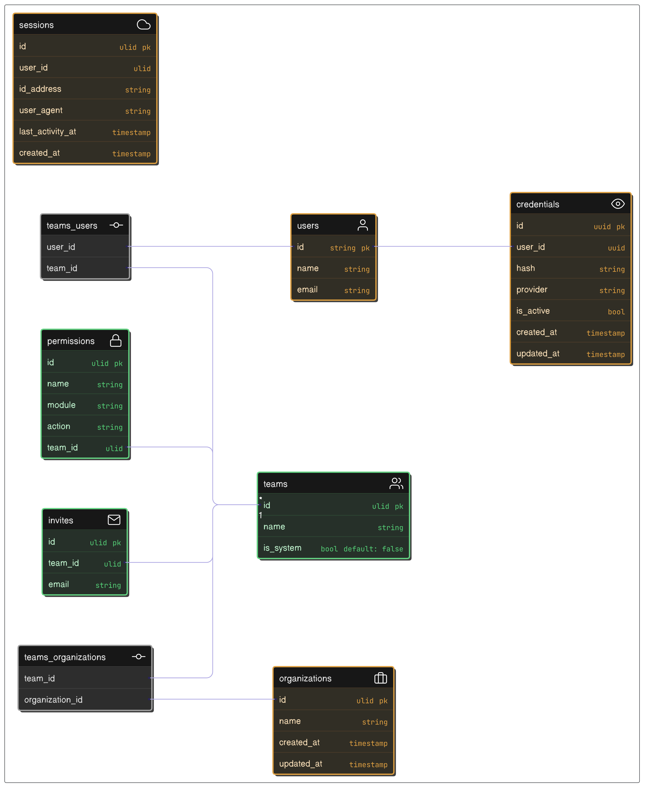

# Authentication and authorization application

Project developed with the objective of deepening knowledge in Java using the Spring Boot framework, applying the principles of clean architecture and exploring communication between microservices.

Image below shows the database modeling



## Setup

1. Download the repository `git clone git@github.com:mr4torr/saas-auth.git`;
2. Make a copy of the `.env.example` file and place it as `.env`;
3. Create a docker-compose.yml file, this file is used to run the database.
4. Run `docker compose up -d` and then run `./mvnw spring-boot:run`
5. Access `http://localhost:8080/swagger-ui.html` to view the API documentation.
 
```yml
version: '3.8'
services:
  postgres:
    image: postgres:17.4-alpine
    container_name: saas_db
    environment:
      POSTGRES_DB: saas
      POSTGRES_USER: postgres
      POSTGRES_PASSWORD: root
    ports:
      - "5432:5432"
    restart: always
```